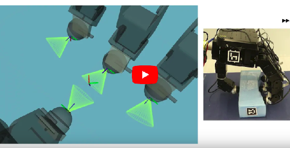

## Haptic exploration of unknown objects to optimize the grasp stability during dexterous robotic manipulation

This website is currently incomplete as the paper is under review. The links are pointing to an older paper. They will be updated after the publication.

G. Solak and L. Jamone. Learning by demonstration and robust control of dexterous in-hand robotic manipulation skills. In IEEE/RSJ International Conference on Intelligent Robots and Systems. IEEE, 2019.

#### Abstract
Lorem ipsum dolor sit amet, consectetur adipiscing elit. Aenean massa est, tincidunt sit amet ex vel, gravida pellentesque orci. Cras vehicula nisi nisl. Duis sed vestibulum sapien, ac rutrum nisi. Aliquam erat volutpat. Etiam nibh urna, varius eu venenatis id, eleifend ac justo. Proin dignissim quis leo eget cursus. Aliquam et nunc eget nunc blandit rutrum. In lobortis venenatis tempor. Donec ut laoreet sem, id laoreet justo. Sed eget commodo felis. 

### Authors
* [Gokhan Solak](https://scholar.google.com/citations?user=yuOV2TQAAAAJ&hl=en)
* [Lorenzo Jamone](https://scholar.google.com/citations?hl=en&user=glrd-2AAAAAJ)

### Links
* [Code](https://github.com/gokhansolak/lfd-experiments-iros2019)
* [Paper](https://ieeexplore.ieee.org/document/8967567)
